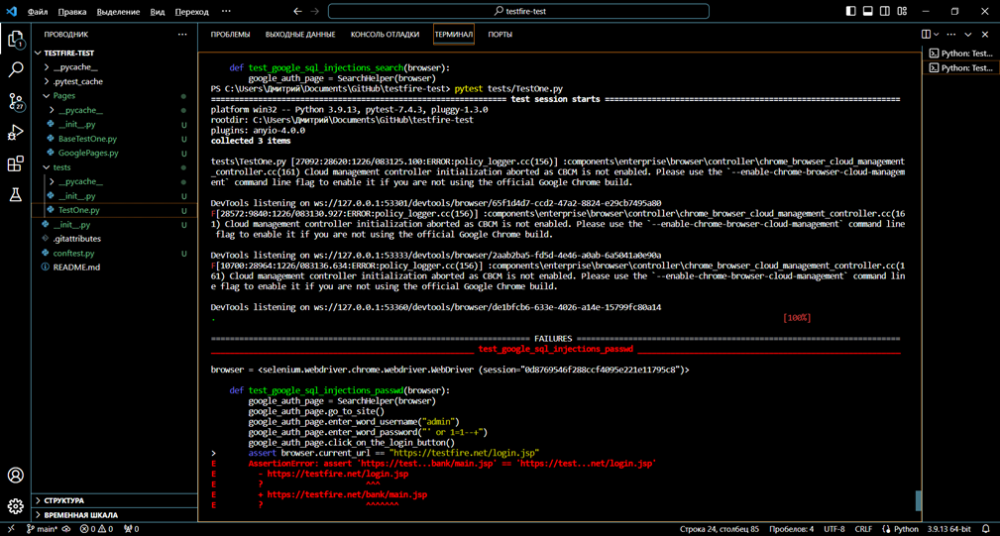
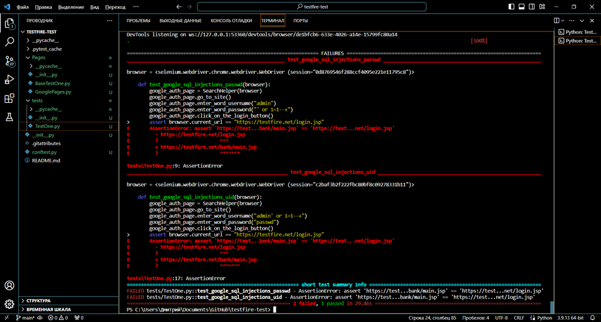
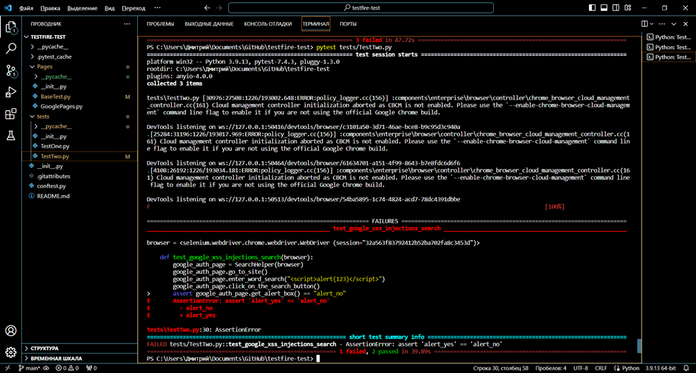

# testfire-test
 
This work is an automated testing of the forms for entering the authentication page of a web resource testfire.net , executed using the Page Object pattern.
This testing consists of testing for resistance to sql injections and testing for resistance to xss injections.
When writing automated tests, the Python programming language, the Selenium webdriver module for interacting with web resources, and the Pytest testing module are used.

in the beginning, a function was created to be able to use the same web driver settings for all test files

after that, the main page was written, where the basic manipulations required for testing were written, this is an object search, or an object search

the third file contains the main modules that allow you to interact with a web resource as part of testing

due to the high versatility of such a scheme, the need to duplicate these files for the second test is lost, therefore, for the first and second tests, which will be located in separate files, the remaining files will be shared.

testing for the robustness of input forms to sql injections is performed in a file TestOne.py , where the algorithm for performing testing is prescribed, as well as checking the result.
the testing algorithm is simple, the transition to the desired web resource takes place, the necessary fields are filled in with either data or sql injection, the data sending button is pressed (either Login or Go), and the transition to the user's page is checked or not.
Such tests are performed for each localized input form.

based on the test results, the username and password input fields are not protected from sql injections, whereas access could not be obtained through the search field.

testing for the resistance of input forms to xss injections is performed in a file TestTwo.py , where the algorithm for performing testing is prescribed, as well as checking the result.
The testing algorithm is simple, the transition to the desired web resource takes place, the necessary fields are filled in with either data or xss injection, the data sending button is pressed (either Login or Go), and the alert is checked.
Such tests are performed for each localized input form.

Based on the test results, the username and password input fields are protected from xss injections, whereas cross-site scripting is performed through the search field.
